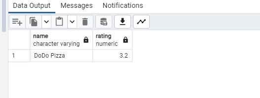
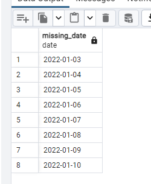
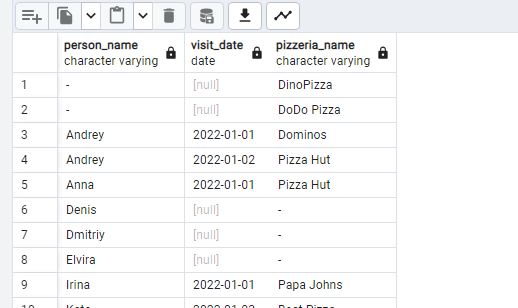
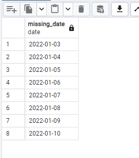
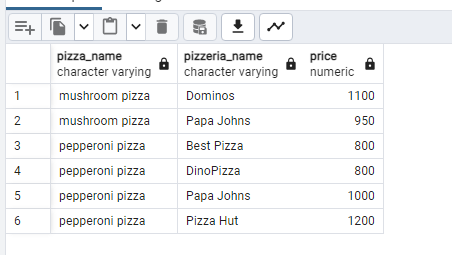
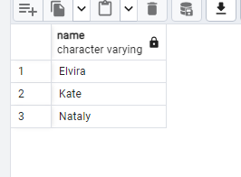
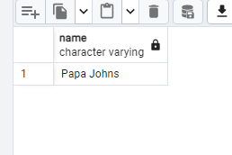
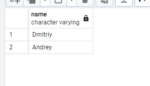
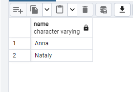

## Exercise 00 - Move to the LEFT, move to the RIGHT
Please write a SQL statement which returns a list of pizzerias names with corresponding rating value which have not been visited by persons. 
```sql
SELECT pizzeria.name, rating
From pizzeria
Left JOIN person_visits ON person_visits.pizzeria_id = pizzeria.id
Where person_visits.person_id is NULL;
```


## Exercise 01 - Find data gaps

Please write a SQL statement which returns the missing days from 1st to 10th of January 2022 (including all days) for visits  of persons with identifiers 1 or 2 (it means days missed by both). Please order by visiting days in ascending mode. The sample of data with column name is presented below.
```sql
SELECT missing_date
FROM (
        SELECT '2022-01-01'::date + generate_series(0, 9) AS missing_date
    ) AS date_range
    LEFT JOIN (
        SELECT DISTINCT
            visit_date
        FROM person_visits pv
        WHERE
            person_id IN (1, 2)
    ) AS visited_dates ON date_range.missing_date = visited_dates.visit_date
WHERE
    visited_dates.visit_date IS NULL
ORDER BY missing_date;

```


## Exercise 02 - FULL means ‘completely filled’

Please write a SQL statement that returns a whole list of person names visited (or not visited) pizzerias during the period from 1st to 3rd of January 2022 from one side and the whole list of pizzeria names which have been visited (or not visited) from the other side. The data sample with needed column names is presented below. Please pay attention to the substitution value ‘-’ for `NULL` values in `person_name` and `pizzeria_name` columns. Please also add ordering for all 3 columns.

```sql

SELECT
    COALESCE(p.name, '-') AS person_name,
    pv.visit_date,
    COALESCE(pz.name, '-') AS pizzeria_name
FROM (
        SELECT DISTINCT
            *
        FROM person_visits
        WHERE
            visit_date BETWEEN '2022-01-01' AND '2022-01-03'
    ) AS pv
    FULL JOIN person p ON pv.person_id = p.id
    FULL JOIN pizzeria pz ON pv.pizzeria_id = pz.id
ORDER BY
    person_name ASC,
    visit_date ASC,
    pizzeria_name ASC;

```


## Exercise 03 - Reformat to CTE

Let’s return back to Exercise #01, please rewrite your SQL by using the CTE (Common Table Expression) pattern. Please move into the CTE part of your "day generator". The result should be similar like in Exercise #01
```sql

WITH
    date_range AS (
        SELECT '2022-01-01'::date + generate_series(0, 9) AS missing_date
    ),
    visited_dates AS (
        SELECT DISTINCT
            visit_date
        FROM person_visits
        WHERE
            person_id IN (1, 2)
    )
SELECT dr.missing_date
FROM
    date_range dr
    LEFT JOIN visited_dates vd ON dr.missing_date = vd.visit_date
WHERE
    vd.visit_date IS NULL
ORDER BY dr.missing_date;

```


## Exercise 04 - Find favourite pizzas

Find full information about all possible pizzeria names and prices to get mushroom or pepperoni pizzas. Please sort the result by pizza name and pizzeria name then. The result of sample data is below (please use the same column names in your SQL statement).

```sql

SELECT
    pizza_name,
    pizzeria.name AS pizzeria_name,
    price
FROM menu
    JOIN pizzeria ON menu.pizzeria_id = pizzeria.id
WHERE
    menu.pizza_name IN (
        'mushroom pizza',
        'pepperoni pizza'
    )
ORDER BY menu.pizza_name, pizzeria.name;
```


## Exercise 05 - Investigate Person Data

Find names of all female persons older than 25 and order the result by name. The sample of output is presented below.
```sql
WITH
    Parameteres AS (
        SELECT age, gender, name
        FROM person
        WHERE
            age > 25
            AND gender = 'female'
    )
SELECT name
FROM Parameteres
ORDER BY name;

```


## Exercise 06 - favourite pizzas for Denis and Anna

Please find all pizza names (and corresponding pizzeria names using `menu` table) that Denis or Anna ordered. Sort a result by both columns. The sample of output is presented below.
```sql


SELECT menu.pizza_name, pizzeria.name
FROM
    person_order po
    JOIN menu ON po.menu_id = menu.id
    JOIN pizzeria ON menu.pizzeria_id = pizzeria.id
WHERE
    po.person_id IN (
        SELECT id
        FROM person
        WHERE
            name IN ('Denis', 'Anna')
    )
ORDER BY menu.pizza_name, pizzeria.name;

```


## Exercise 07 - Cheapest pizzeria for Dmitriy

Please find the name of pizzeria Dmitriy visited on January 8, 2022 and could eat pizza for less than 800 rubles.

```sql

SELECT pizzeria.name
FROM person_visits pv
    JOIN pizzeria ON pv.pizzeria_id = pizzeria.id
WHERE
    pv.person_id = (
        SELECT id
        FROM person
        WHERE
            name = 'Dmitriy'
    )
    AND pv.visit_date = '2022-01-08'
    AND pizzeria.id IN (
        SELECT pizzeria.id
        FROM menu
        WHERE
            price < 800
    );

```



## Exercise 08 - Continuing to research data

Please find the names of all males from Moscow or Samara cities who orders either pepperoni or mushroom pizzas (or both) . Please order the result by person name in descending mode. The sample of output is presented below.

```sql


SELECT name
FROM
    person p
    JOIN person_order po ON p.id = po.person_id
    JOIN menu ON po.menu_id = menu.id
WHERE
    p.address IN ('Moscow', 'Samara')
    AND p.gender = 'male'
    AND menu.pizza_name IN (
        'pepperoni pizza',
        'mushroom pizza'
    )
ORDER BY p.name DESC;
```


## Exercise 09 - Who loves cheese and pepperoni?

Please find the names of all females who ordered both pepperoni and cheese pizzas (at any time and in any pizzerias). Make sure that the result is ordered by person name. The sample of data is presented below.
```sql

SELECT name
FROM
    person p
    JOIN person_order po ON p.id = po.person_id
    JOIN menu m ON po.menu_id = m.id
WHERE
    p.gender = 'female'
GROUP BY
    p.id,
    p.name
HAVING
    COUNT(
        DISTINCT CASE
            WHEN m.pizza_name = 'pepperoni pizza' THEN 1
        END
    ) > 0
    AND COUNT(
        DISTINCT CASE
            WHEN m.pizza_name = 'cheese pizza' THEN 1
        END
    ) > 0
ORDER BY name;

```


